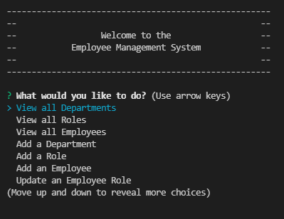
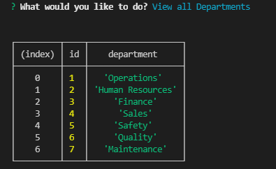
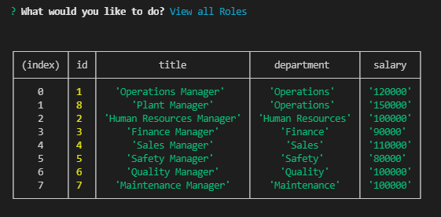
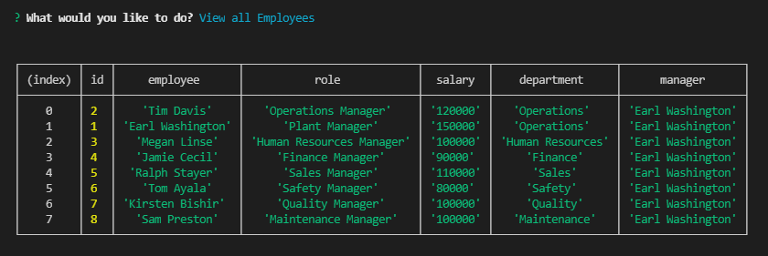

# Employee Management System

## Description

The Employee Management System is  command-line content management system that enables business owners to manage and track employee data. Built with Node.js, Inquirer, and MySQL.

* [GitHub Repo](https://github.com/spreston4/employee-management-system)

## Table of Contents

* [How To](#how-to)
* [Intallation](#installation)
* [Technologies Used](#technologies-used)
* [Finished Product](#finished-product)
* [User Story](#user-story)
* [Acceptance Criteria](#acceptance-criteria)
* [Contact Me](#contact-me)

## How To

* Run 'node index.js' to start the application
* Choose an action:
    - View all Departments
    - View all Roles
    - View all Employees
    - Add a Department
    - Add a Role
    - Add an Employee
    - Update an Employee Role
* Answer follow-up questions based on selected action
* Select 'Exit Application' to quit.

## Installation

To install necessary dependencies, run the following command:
```
npm install
```

## Finished Product

* [Video demo of the Employee Management System](https://drive.google.com/file/d/1mt47EnnMJoJV0RsauiJWek-e3TM-rV29/view)










## Technologies Used

Built in Visual Studion with:
* MySQL 
* Node.js
* JavaScript
* Inquirer.js
* npm


## User Story

```md
AS A business owner
I WANT to be able to view and manage the departments, roles, and employees in my company
SO THAT I can organize and plan my business
```

## Acceptance Criteria

```md
GIVEN a command-line application that accepts user input
WHEN I start the application
THEN I am presented with the following options: view all departments, view all roles, view all employees, add a department, add a role, add an employee, and update an employee role
WHEN I choose to view all departments
THEN I am presented with a formatted table showing department names and department ids
WHEN I choose to view all roles
THEN I am presented with the job title, role id, the department that role belongs to, and the salary for that role
WHEN I choose to view all employees
THEN I am presented with a formatted table showing employee data, including employee ids, first names, last names, job titles, departments, salaries, and managers that the employees report to
WHEN I choose to add a department
THEN I am prompted to enter the name of the department and that department is added to the database
WHEN I choose to add a role
THEN I am prompted to enter the name, salary, and department for the role and that role is added to the database
WHEN I choose to add an employee
THEN I am prompted to enter the employee’s first name, last name, role, and manager, and that employee is added to the database
WHEN I choose to update an employee role
THEN I am prompted to select an employee to update and their new role and this information is updated in the database 
```

## Contact Me

Questions, comments, or concerns about this project? Contact me at Github or via e-mail.

* GitHub: [spreston4](https://github.com/spreston4)

* E-mail: [sam.preston11@gmail.com](mailto:sam.preston11@gmail.com)

